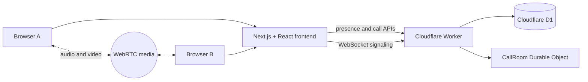

# CallKaro

<p align="center">
	<strong>A warm, browser-first workspace for quick video conversations.</strong>
	<br />
	Start a private call, open a shared room, and keep the connection in your hands.
</p>

<p align="center">
	<a href="https://nextjs.org/"></a>
	<a href="https://developers.cloudflare.com/workers/"></a>
	<a href="https://developer.mozilla.org/en-US/docs/Web/API/WebRTC_API"></a>
	<a href="https://github.com/CallKaro/CallKaro/actions"></a>
</p>

<p align="center">
	<a href="#quick-start">Quick start</a> ·
	<a href="docs/cloudflare_deployment.md">Deploy</a> ·
	<a href="docs/readme.md">Documentation</a>
</p>

> CallKaro is an experimental real-time communication app built around WebRTC, Cloudflare Workers, D1, and Durable Objects.

## Contents

- [At a glance](#at-a-glance)
- [What it does](#what-it-does)
- [Features](#features)
- [Architecture](#architecture)
- [Technology](#technology)
- [Quick start](#quick-start)
- [How to use it](#how-to-use-it)
- [Deploy to Cloudflare](#deploy-to-cloudflare)
- [Repository map](#repository-map)
- [Known limitations](#known-limitations)
- [Getting help](#getting-help)
- [Contributing](#contributing)
- [License](#license)

## What it does

CallKaro gives small groups a lightweight place to meet without putting audio or video through an application media server.

The app has two communication modes:

| Mode | Best for | How it works |
| --- | --- | --- |
| **1-on-1 Video Calling** | Calling one available person | Presence discovery and call invites coordinate a deterministic direct-call room. |
| **Video Rooms** | Joining a named group conversation | A room name maps to a Durable Object that coordinates every participant. |

After signaling, browsers establish WebRTC peer connections. The backend coordinates the call; it does not relay the media stream.

## At a glance

CallKaro is a learning-focused real-time communication app for small groups. It explores how far a browser-first architecture can go with WebRTC and Cloudflare primitives, while keeping the product simple enough to run locally and inspect end to end.

| Start here | Purpose |
| --- | --- |
| [Open the app locally](#quick-start) | Run the frontend and Worker together |
| [Read the architecture](#architecture) | Understand signaling, presence, and room ownership |
| [Try both workflows](#how-to-use-it) | Test a direct call and a shared room in separate browser profiles |

> **Project status:** Experimental. The core call and room flows work locally, but production authentication, TURN infrastructure, and a declared open-source license are still pending.

## Features

- Online-user directory with expiring presence records
- Incoming, outgoing, accepted, rejected, and ended call states
- Multi-participant rooms with room discovery
- Browser camera and microphone controls
- Remote media-state indicators
- Responsive video tiles with drag-and-drop ordering
- Spotlight and restore views for individual tiles
- Local identity persistence with session cleanup
- Cloudflare-native backend deployment

## Architecture



### Runtime responsibilities

- **Frontend**: identity, presence registration, call controls, WebSocket client, and `RTCPeerConnection` lifecycle.
- **Worker**: HTTP API routing, validation, CORS responses, D1 access, and WebSocket upgrade routing.
- **D1**: online users, call invitations, and named-room presence.
- **Durable Object**: one synchronized participant space per room, WebSocket membership, signaling delivery, and participant events.

## Technology

| Layer | Tools |
| --- | --- |
| UI | Next.js 16, React 19, Tailwind CSS 4 |
| Media | WebRTC, browser MediaDevices API |
| Realtime transport | WebSocket, Cloudflare Durable Objects |
| Backend | Cloudflare Workers, TypeScript |
| Persistence | Cloudflare D1 and Durable Object SQLite |
| Testing | Vitest, `@cloudflare/vitest-plugin`, Playwright helper sessions |
| Deployment | Wrangler and Vinext Cloudflare adapter |

The stack is intentionally split by responsibility: React renders the workspace, WebRTC carries audio and video directly between browsers, the Worker exposes coordination APIs, D1 stores short-lived presence, and Durable Objects own synchronized rooms.

## Quick start

### Prerequisites

- Node.js and npm
- A browser with camera and microphone support
- Camera and microphone permissions for local testing

### Install

```bash
git clone <your-repository-url>
cd CallKaro

cd backend
npm install

cd ../frontend
npm install
```

### Run locally

Start the backend in one terminal:

```bash
cd backend
npm run dev
```

Start the frontend in a second terminal:

```bash
cd frontend
npm run dev
```

Open [http://localhost:3000](http://localhost:3000). The frontend defaults to the backend at `http://localhost:8787`.

To use another backend URL, set it before starting the frontend:

```bash
cd frontend
NEXT_PUBLIC_API_URL=http://localhost:8787 npm run dev
```

For a meaningful call test, open the app in two separate browser profiles or use the Playwright session helper described in [backend/test/browser.session.ts](backend/test/browser.session.ts).

### Verify the backend

Run the backend test suite before a browser session:

```bash
cd backend
npm test -- --run
```

The frontend can be checked independently with:

```bash
cd frontend
npm run lint
npm run build
```

## How to use it

### Make a direct call

1. Open `/call` and enter a display name.
2. Choose **1-on-1 Video Calling**.
3. Select an online person and wait for them to accept.
4. Allow camera and microphone access.
5. Use the call controls to mute audio, disable video, or leave.

### Join a video room

1. Choose **Video Rooms**.
2. Enter a room name or choose an active room.
3. Allow camera and microphone access.
4. Share the room name with other participants.
5. Reorder, spotlight, resize, or leave video tiles as needed.

## Deploy to Cloudflare

Deploy the backend first, then build the frontend with its public URL:

```bash
# Authenticate once per machine
npx wrangler login

# Deploy the Worker, D1 binding, and Durable Object
cd backend
npm test -- --run
npm run deploy

# Build and deploy the frontend against the Worker URL
cd ../frontend
NEXT_PUBLIC_API_URL=https://backend.<your-subdomain>.workers.dev npm run build:vinext
npm run deploy:vinext
```

Confirm the backend before opening the frontend:

```bash
curl https://backend.<your-subdomain>.workers.dev/health
```

Expected response:

```json
{"ok":true}
```

Read the complete [Cloudflare deployment guide](docs/cloudflare_deployment.md) for bindings, custom domains, environment files, verification, and troubleshooting.

## Repository map

```text
CallKaro/
├── backend/
│   ├── src/index.ts                 Worker routes and CallRoom Durable Object
│   ├── test/index.spec.ts           Health endpoint tests
│   ├── test/browser.session.ts      Manual multi-browser test launcher
│   └── wrangler.jsonc               D1 and Durable Object deployment config
├── frontend/
│   ├── src/app/page.tsx             Landing page
│   ├── src/app/call/page.tsx        Workspace shell and identity entry
│   ├── src/app/components/
│   │   ├── useCallRoom.ts           WebSocket and WebRTC coordination
│   │   ├── VideoCall.tsx             Direct-call workflow
│   │   └── VideoRooms.tsx            Group-room workflow
│   ├── public/                      Static assets, including robots.txt
│   └── wrangler.jsonc               Frontend Cloudflare deployment config
├── docs/                            Architecture, flows, setup, and deployment notes
└── readme.md                        This overview
```

## Known limitations

- WebRTC currently uses Google's public STUN server and has no TURN server configured. Some restrictive networks may not establish media connections.
- Presence and call invites are short-lived coordination records, not user accounts or durable message history.
- The backend creates its D1 tables lazily from the Worker code.
- `robots.txt` asks compliant crawlers not to access the site, but it is not an access-control mechanism.
- No production authentication or authorization layer is currently implemented.

## Getting help

Open an issue with the browser, deployment mode, console error, and the result of `GET /health`. For call failures, also include whether the failure affects direct calls, rooms, or both.

## Documentation

The [docs index](docs/readme.md) links to focused guides:

- [Backend architecture](docs/backend_architecture.md)
- [Backend working flow](docs/backend_working.md)
- [Frontend architecture](docs/frontend_architecture.md)
- [Frontend working flow](docs/frontend_working.md)
- [Backend file structure](docs/be_file_struct.md)
- [Frontend file structure](docs/fe_file_struct.md)
- [Cloudflare deployment](docs/cloudflare_deployment.md)

## Contributing

Contributions are welcome. Before opening a change:

1. Read the relevant architecture and working-flow documentation.
2. Keep frontend and backend changes scoped to their owning package.
3. Run the backend tests with `cd backend && npm test -- --run`.
4. Run frontend checks with `cd frontend && npm run lint` and `npm run build` when applicable.
5. Describe browser permissions, network assumptions, and manual call testing in the pull request.

For bugs, include the browser, deployment mode, console errors, and whether `/health` succeeds.

## License

No license file is currently declared in this repository. Add a `LICENSE` file before distributing CallKaro under an open-source license.

## Acknowledgments

The README structure takes inspiration from the following public README resources:

- [READMINE](https://github.com/mhucka/readmine), for its thorough software-project documentation structure
- [Awesome README](https://github.com/matiassingers/awesome-readme), for its emphasis on visual examples and navigable project documentation
- [Awesome GitHub Profile README](https://github.com/abhisheknaiidu/awesome-github-profile-readme), for its use of concise presentation and discoverable sections

<p align="center">
	<a href="#callkaro">Back to top</a>
</p>
